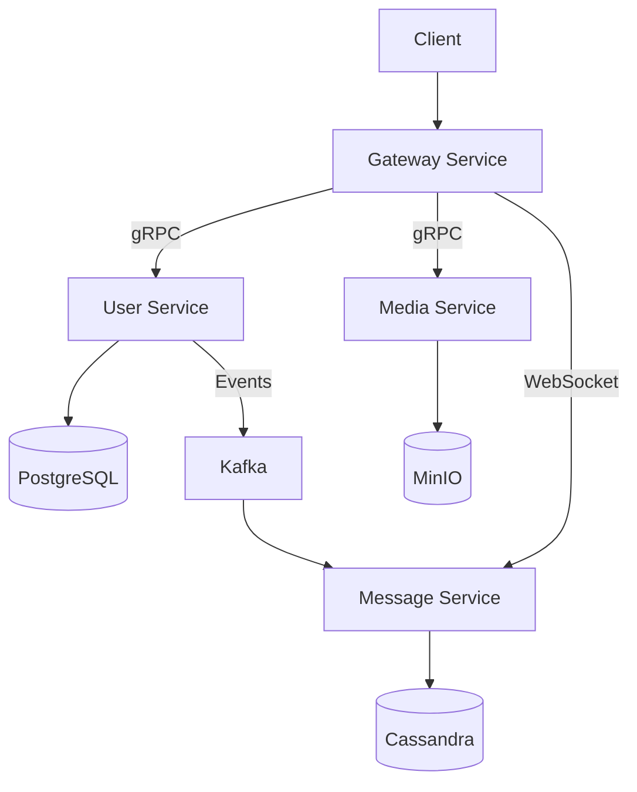

# GOmessager 📱

> Modern, scalable messaging platform built with Go and microservices architecture


## 🌟 Features

- **Real-time Messaging** - Lightning-fast communication via WebSocket
- **Media Sharing** - Secure file uploads and sharing
- **Friend Management** - Add and manage friend connections
- **Microservices Architecture** - Scalable and maintainable design
- **JWT Authentication** - Secure user authentication
- **Event-Driven** - Kafka-based event processing

## 🏗 Architecture



## 🚀 Quick Start

### Prerequisites

- Go 1.21+
- Docker and Docker Compose
- Make (optional)

### Setup

1. Clone the repository:
```bash
git clone https://github.com/yourusername/gomessager.git
make docker-up
```

2. Set up environment configs (see Configuration section)
3. Run services:
```bash
docker-compose up -d
```

## ⚙️ Configuration

### User Service
```yaml
# /user/config/config.yml
postgre:
  host: "localhost"
  port: "5430"
  username: "blxxd"
  password: "blxxd"
  dbname: "users_db"
  sslmode: false
  connectAttempt: 3

grpc:
  addr: "localhost:9022"

kafka:
  topic: "chat-topic"
```

### Message Service
```yaml
# /message/config/config.yml
jwt:
  secret: "super-duper-secret"

kafka:
  topic: "chat-topic"
  consumer-group: "chat-consumer-group"

ws:
  addr: "192.168.0.124:8082"
```

### Media Service
```yaml
# /media/config/config.yml
minio:
  storage: "media-storage"
  endpoint: "localhost:9020"
  bucket: "media-storage"
  accessKeyID: "0qcVuqsLmaKtJVHflEMw"
  secretKeyID: "QN8nTUmsZUK7NA9VnblSDj0NwHBBXcthG5Fc4eOU"
```

### Gateway Service
```yaml
# /gateway/config/config.yml
grpc:
  user_service: "localhost:9022"
  media_service: "localhost:9023"

http:
  addr: "localhost:8080"

jwt:
  secret: "super-duper-secret"
```

## 🔧 Infrastructure Setup

### Docker Compose Example
```yaml
version: '3.8'

services:
  postgres:
    image: postgres:latest
    environment:
      POSTGRES_USER: blxxd
      POSTGRES_PASSWORD: blxxd
      POSTGRES_DB: users_db
    ports:
      - "5430:5432"
    volumes:
      - postgres_data:/var/lib/postgresql/data

  cassandra:
    image: cassandra:latest
    ports:
      - "9042:9042"
    volumes:
      - cassandra_data:/var/lib/cassandra

  kafka:
    image: confluentinc/cp-kafka:latest
    ports:
      - "9092:9092"
    environment:
      KAFKA_ADVERTISED_LISTENERS: PLAINTEXT://kafka:9092
      KAFKA_AUTO_CREATE_TOPICS_ENABLE: "true"

  minio:
    image: minio/minio
    ports:
      - "9020:9000"
      - "9021:9001"
    environment:
      MINIO_ROOT_USER: 0qcVuqsLmaKtJVHflEMw
      MINIO_ROOT_PASSWORD: QN8nTUmsZUK7NA9VnblSDj0NwHBBXcthG5Fc4eOU
    command: server /data --console-address ":9001"
    volumes:
      - minio_data:/data

volumes:
  postgres_data:
  cassandra_data:
  minio_data:
```

## 📦 Service Dependencies

### Core Libraries
```go
require (
    github.com/confluentinc/confluent-kafka-go v1.9.2
    github.com/jackc/pgx/v4 v4.18.3
    github.com/gocql/gocql v1.7.0
    github.com/gorilla/websocket v1.5.3
    github.com/minio/minio-go/v7 v7.0.82
    github.com/golang-jwt/jwt/v4 v4.5.1
    github.com/spf13/viper v1.19.0
    google.golang.org/grpc v1.69.2
)
```

## 🔒 API Security

- JWT-based authentication
- HTTPS endpoints
- Secure WebSocket connections
- Encrypted data storage

## 📝 API Documentation

### User Operations
```go
type UserRepository interface {
    Create(ctx context.Context, user *models.UserModel) (string, error)
    FindAll(ctx context.Context) ([]models.UserModel, error)
    FindOne(ctx context.Context, user *models.UserModel) (models.UserModel, error)
    FindById(ctx context.Context, id string) (models.UserModel, error)
    Update(ctx context.Context, user *models.UserModel) error
    Delete(ctx context.Context, id string) (string, error)
}
```

### Friend Operations
```go
type FriendsRepository interface {
    Create(ctx context.Context, friend *models.FriendListModel) (string, error)
    FindAll(ctx context.Context, user_id string) ([]models.FriendListModel, error)
    Delete(ctx context.Context, friends *models.FriendListModel) error
}
```

## 🤝 Contributing

1. Fork the repository
2. Create your feature branch (`git checkout -b feature/amazing-feature`)
3. Commit your changes (`git commit -m 'Add some amazing feature'`)
4. Push to the branch (`git push origin feature/amazing-feature`)
5. Open a Pull Request

## 📄 License

This project is licensed under the MIT License - see the [LICENSE](LICENSE) file for details.

## 🙏 Acknowledgments

- Thanks to all contributors who have helped shape GOmessager
- Built with ❤️ using Go and modern cloud-native technologies
